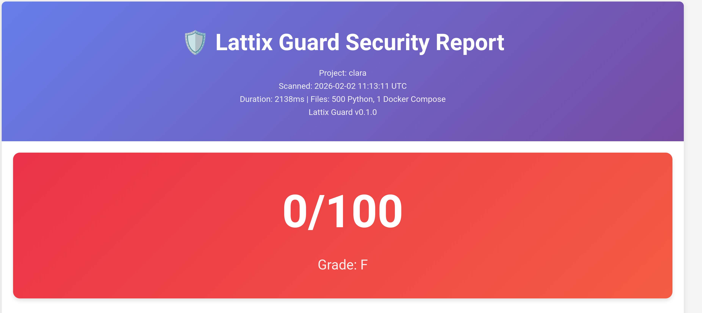

Lattix Guard
# Lattix Guard

🛡️ **Static security auditing tool for Docker/FastAPI projects**

Lattix Guard performs static analysis of Docker Compose configurations and Python code to detect common security misconfigurations. It generates comprehensive reports with actionable recommendations.

## Features

- ✅ **20+ Security Rules** covering Docker, FastAPI, and general best practices
- 📊 **Score-Based Assessment** (0-100) with letter grades
- 📝 **Dual Report Formats**: JSON (machine-readable) and HTML (human-readable)
- 🔒 **Security-First Design**: Safe YAML parsing, no code execution, input sanitization
- 🔌 **Extensible Rule System**: Easy to add custom rules
- ⚡ **Fast Static Analysis**: No active scanning or runtime dependencies

## Installation

```bash
# Clone the repository
git clone https://github.com/claramercury/lattix-guard.git
cd lattix-guard

# Install dependencies
pip install -r requirements.txt
```

## Usage

### Basic Scan

```bash
python -m lattix_guard /path/to/project
```

### Specify Output Directory

```bash
python -m lattix_guard /path/to/project --out ./security-reports
```

### Choose Report Format

```bash
# JSON only
python -m lattix_guard /path/to/project --format json

# HTML only
python -m lattix_guard /path/to/project --format html

# Both (default)
python -m lattix_guard /path/to/project --format both
```

### CI/CD Integration

Fail the build if critical or high severity issues are found:

```bash
# Fail on CRITICAL findings
python -m lattix_guard /path/to/project --fail-on critical

# Fail on HIGH or CRITICAL findings
python -m lattix_guard /path/to/project --fail-on high
```

### Exit Codes

- `0` - Scan successful, no issues or below fail threshold
- `1` - Scan failed (invalid input, parser error)
- `2` - Critical/High findings detected (when using `--fail-on`)

## Security Rules

### Docker/Compose (10 rules)

| Rule ID | Title | Severity | Description |
|---------|-------|----------|-------------|
| DOCKER-001 | Privileged container | CRITICAL | Detects `privileged: true` |
| DOCKER-002 | Host networking | HIGH | Detects `network_mode: host` |
| DOCKER-003 | Exposed ports | HIGH | Ports exposed to `0.0.0.0` |
| DOCKER-004 | Docker socket mount | CRITICAL | `/var/run/docker.sock` mounted |
| DOCKER-005 | Secrets in environment | HIGH | Hardcoded secrets in env vars |
| DOCKER-006 | Latest tag | LOW | Using `:latest` image tag |
| DOCKER-007 | Missing user directive | MEDIUM | Container runs as root |
| DOCKER-008 | Capability additions | MEDIUM | Linux capabilities added |
| DOCKER-009 | Dangerous volumes | HIGH | System directories mounted |
| DOCKER-010 | Database port exposed | HIGH | DB ports (3306, 5432, etc.) exposed |

### FastAPI/Python (8 rules)

| Rule ID | Title | Severity | Description |
|---------|-------|----------|-------------|
| FASTAPI-001 | CORS wildcard | HIGH | `allow_origins=["*"]` |
| FASTAPI-002 | Docs enabled | MEDIUM | API docs not disabled |
| FASTAPI-003 | .env not in .gitignore | CRITICAL | .env file tracked by git |
| FASTAPI-004 | Hardcoded secrets | CRITICAL | `SECRET_KEY` hardcoded |
| FASTAPI-005 | Debug mode | HIGH | `DEBUG=True` |
| FASTAPI-006 | JWT expiration | MEDIUM | Missing JWT expiration checks |
| FASTAPI-007 | Logging secrets | MEDIUM | Tokens/secrets in logs |
| FASTAPI-008 | OpenAPI exposed | LOW | OpenAPI endpoint not disabled |

### General (2 rules)

| Rule ID | Title | Severity | Description |
|---------|-------|----------|-------------|
| GENERAL-001 | Certificates in repo | CRITICAL | `.pem`, `.key`, `.crt` files found |
| GENERAL-002 | Missing .gitignore | MEDIUM | No or insufficient .gitignore |

## Score Interpretation

| Score | Grade | Description |
|-------|-------|-------------|
| 90-100 | A | Excellent security posture |
| 80-89 | B | Good security, minor improvements needed |
| 70-79 | C | Fair security, several issues to address |
| 60-69 | D | Poor security, significant gaps |
| 0-59 | F | Critical issues, immediate action required |

## Security Guarantees

Lattix Guard is designed with security in mind:

1. **Safe YAML Parsing**: Uses `yaml.safe_load()` only with size/depth/key limits
2. **No Code Execution**: 100% static analysis, no `eval()`, `exec()`, or imports
3. **Input Sanitization**: All user-derived content escaped in HTML reports
4. **Path Safety**: Only relative paths in reports, no symlink following
5. **Resource Limits**: Max 500 files scanned, 1MB YAML files, 10s timeout

## Adding Custom Rules

Create a new rule by inheriting from `Rule` and decorating with `@register_rule`:

```python
from lattix_guard.rules.base import Rule, Severity, Finding, Evidence
from lattix_guard.rules import register_rule

@register_rule
class MyCustomRule(Rule):
    @property
    def id(self) -> str:
        return "CUSTOM-001"

    @property
    def title(self) -> str:
        return "My security check"

    @property
    def severity(self) -> Severity:
        return Severity.HIGH

    def check(self, parsed_data: dict) -> List[Finding]:
        findings = []
        # Your detection logic here
        return findings
```

Rules are automatically discovered and executed.

## Development

### Run Tests

```bash
pytest tests/ -v
```

### Run with Coverage

```bash
pytest --cov=lattix_guard tests/
```

### Project Structure

```
lattix_guard/
├── lattix_guard/           # Main package
│   ├── rules/              # Security rules
│   │   ├── base.py         # Rule base class
│   │   ├── docker_rules.py # Docker rules
│   │   ├── fastapi_rules.py# FastAPI rules
│   │   └── general_rules.py# General rules
│   ├── parsers/            # File parsers
│   │   ├── compose_parser.py
│   │   ├── python_parser.py
│   │   └── env_parser.py
│   ├── scanner.py          # Main scanner
│   ├── scoring.py          # Score calculation
│   ├── report.py           # Report generation
│   └── cli.py              # CLI interface
├── templates/              # HTML templates
│   └── report.html.jinja
├── tests/                  # Test suite
└── examples/               # Example projects
```

## Example Output

```
Lattix Guard v0.1.0 - Security Auditing Tool
==================================================

Scanning: /home/clara
  Files scanned: 2 Python, 1 Docker Compose

==================================================
SECURITY SCORE: 88/100 (Grade B)
  Good security, minor improvements needed

Findings by Severity:
  CRITICAL: 0
  HIGH:     0
  MEDIUM:   0
  LOW:      2
  INFO:     0

Reports generated:
  ✓ ./lattix_guard_reports/report.json
  ✓ ./lattix_guard_reports/report.html

Open ./lattix_guard_reports/report.html in your browser for details.
```

## License

MIT License - See [LICENSE](LICENSE) file for details

## Contributing

Contributions welcome! Please:
1. Fork the repository
2. Create a feature branch
3. Add tests for new rules
4. Submit a pull request

## Author

Clara Mercury - [GitHub](https://github.com/claramercury)

Part of the [Lattix](https://github.com/claramercury/lattix) project
# Lattix Guard

**Static security scanner for Docker, FastAPI, and Python projects.**

Lattix Guard analyzes configurations and code to detect common security vulnerabilities without executing any code. It generates detailed reports in JSON and HTML formats with quantitative scores (0-100) and severity classifications.

**Design Principles:**
- ✅ Static analysis only (no code execution)
- ✅ Safe by construction (yaml.safe_load, input validation, timeouts)
- ✅ Extensible rule system
- ✅ Zero false sense of security - honest about limitations

---

## Quick Start
```bash
# Clone repository
git clone https://github.com/claramercury/lattix-guard.git
cd lattix-guard

## Installation
```bash
# Clone the repository
git clone https://github.com/claramercury/lattix-guard.git
cd lattix-guard

# Create virtual environment
python -m venv venv
source venv/bin/activate  # Linux/macOS
# Windows: venv\Scripts\activate

# Install dependencies
pip install -r requirements.txt

# Run tests
pytest
```

# Install dependencies
pip install -r requirements.txt

# Run tests
pytest

# Scan a project
python -m lattix_guard /path/to/project --out ./reports
```

---

## Features

### 20+ Security Rules

**Docker/Compose (10 rules):**
- Privileged mode detection
- Latest tag usage
- Root user detection
- Exposed ports without binding
- Secrets in environment variables
- Host network mode
- Docker socket mounting
- Dangerous volume mounts
- Missing user specification
- Capability additions

**FastAPI/Python (8 rules):**
- CORS wildcard detection
- Exposed API documentation
- Hardcoded secrets
- Debug mode in production
- Missing input validation
- Unsafe logging patterns
- JWT configuration issues
- Environment file exposure

**General (2 rules):**
- Certificate/key files in repository
- Missing or insufficient .gitignore

### Scoring System

- **Base score:** 100 points
- **Deductions by severity:**
  - CRITICAL: -20 points
  - HIGH: -10 points
  - MEDIUM: -5 points
  - LOW: -2 points
  - INFO: -0 points
- **Grades:** A (90-100), B (80-89), C (70-79), D (60-69), F (0-59)

---

## Usage

### Basic Scan
```bash
python -m lattix_guard /path/to/project
```

### Options
```bash
--out <directory>       # Output directory (default: ./lattix_guard_reports)
--format json|html|both # Report format (default: both)
--fail-on critical|high # Exit code 2 if issues found
--quiet                 # Minimal output
--verbose               # Detailed output
```

### Examples

**Scan with custom output:**
```bash
python -m lattix_guard ./my-project --out ./security-reports
```

**CI/CD integration (fail on critical issues):**
```bash
python -m lattix_guard . --fail-on critical --quiet
```

---

## Example Output

### Console Output
```
Lattix Guard v0.1.0 - Security Auditing Tool
==================================================

Scanning: /home/user/project
  Files scanned: 15 Python, 1 Docker Compose

==================================================
SECURITY SCORE: 85/100 (Grade B)
  Good security posture with minor issues

Findings by Severity:
  CRITICAL: 0
  HIGH:     1
  MEDIUM:   2
  LOW:      1
  INFO:     0

Reports generated:
  ✓ ./lattix_guard_reports/report.json
  ✓ ./lattix_guard_reports/report.html
```

### HTML Report



The HTML report includes:
- Visual score gauge with color coding
- Findings organized by severity
- Detailed evidence with file locations
- Actionable recommendations
- Responsive design for mobile/desktop

---

## Security Guarantees

Lattix Guard is designed with security as a core principle:

1. **YAML Parsing:** Uses only `yaml.safe_load()` with size limits (1MB), depth limits (12 levels), and timeouts (10s)
2. **Output Sanitization:** All user-provided content is escaped using `markupsafe.escape` and Jinja2 autoescape
3. **Path Safety:** Only relative paths in reports, no absolute system paths exposed
4. **File Scanning:** No symlink following, max 500 files, ignores system directories
5. **Static Analysis:** 100% static - no eval(), exec(), or subprocess with user input
6. **Tested:** Security-focused test suite included

---

## Architecture
```
lattix_guard/
├── lattix_guard/
│   ├── rules/           # Security rules (extensible)
│   │   ├── base.py
│   │   ├── docker_rules.py
│   │   ├── fastapi_rules.py
│   │   └── general_rules.py
│   ├── parsers/         # Safe file parsers
│   │   ├── compose_parser.py
│   │   ├── python_parser.py
│   │   └── env_parser.py
│   ├── scanner.py       # Orchestrator
│   ├── scoring.py       # Score calculation
│   ├── report.py        # Report generation
│   └── cli.py           # CLI interface
├── templates/
│   └── report.html.jinja
├── tests/               # 13 tests covering rules and scoring
└── examples/            # Good and bad configuration examples
```

---

## Adding Custom Rules

Lattix Guard uses a decorator-based rule system:
```python
from lattix_guard.rules.base import Rule, Finding, Severity
from lattix_guard.rules import register_rule

@register_rule
class CustomRule(Rule):
    @property
    def id(self) -> str:
        return "CUSTOM-001"
    
    @property
    def title(self) -> str:
        return "Custom security check"
    
    @property
    def severity(self) -> Severity:
        return Severity.HIGH
    
    def check(self, parsed_data: dict) -> list[Finding]:
        findings = []
        # Your detection logic here
        return findings
```

---

## Testing
```bash
# Run all tests
pytest

# Run with coverage
pytest --cov=lattix_guard tests/

# Run specific test
pytest tests/test_rules.py::test_docker_privileged_detection
```

Test suite includes:
- Rule detection tests (7 tests)
- Scoring calculation tests (6 tests)
- Security validation tests

---

## Contributing

Contributions are welcome! To contribute:

1. Fork the repository
2. Create a feature branch: `git checkout -b feature/new-rule`
3. Add tests for new functionality
4. Ensure all tests pass: `pytest`
5. Submit a pull request with clear description

**Code of Conduct:** Be respectful, inclusive, and constructive.

---

## Limitations & Roadmap

**Current limitations:**
- Static analysis only (no runtime checks)
- Limited to Docker, FastAPI, Python (expandable)
- English-only reports (i18n planned)

**Roadmap:**
- [ ] Kubernetes manifest scanning
- [ ] Terraform/IaC analysis
- [ ] SARIF output format
- [ ] CI/CD integrations (GitHub Actions, GitLab CI)
- [ ] Web interface (optional SaaS version)
- [ ] Additional rule packs (React, Node.js, etc.)

---

## License

Lattix Guard is licensed under **AGPL-3.0**.

This means:
- ✅ Free to use for any purpose
- ✅ Can modify and distribute
- ✅ If you run it as a web service, you must share your modifications

See [LICENSE](LICENSE) for full details.

---

## Credits

Developed by [Clara Rodríguez-Piñero](https://github.com/claramercury) and the Lattix Project collective.

Inspired by research on distributed epistemic verification in multi-agent systems and the principle that security tools should themselves be secure by construction.

**Related Projects:**
- [Lattix Project](https://github.com/claramercury/lattix) - Multi-agent AI research platform

---

## Support

- **Issues:** Report bugs or request features via [GitHub Issues](https://github.com/claramercury/lattix-guard/issues)
- **Discussions:** Join conversations in [GitHub Discussions](https://github.com/claramercury/lattix-guard/discussions)
- **Security:** Report security vulnerabilities privately to [security contact - añadir email]

---

Star ⭐ the repo if you find it useful!

